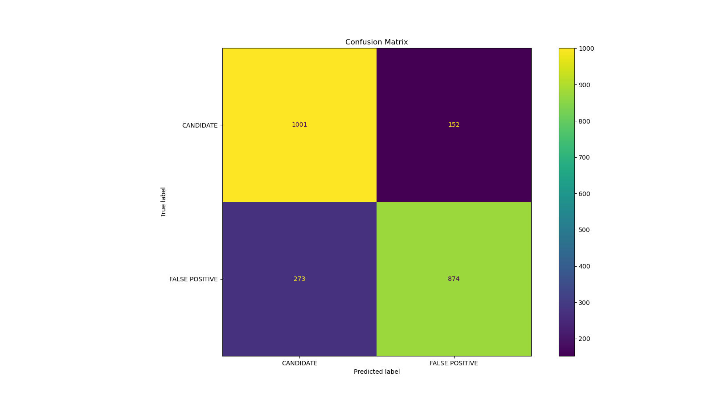

# Kepler Telescope Object Classification
The Kepler Telescoped was launched in 19__ with the goal of collecting data that would help scientists identify exoplanets across the universe. This was accomplished by focusing on nearby stars and monitoring for any periodic small drops in intensity, implying that there is an object passing in front of it. The algorithim in this repository attempts to offer another method of identifying these exoplanets by using the data collected on these various exoplanet candidates. The end goal is to adopt a much quicker method of exoplanet classification.

## Methodology
The dataset used can be divided into two classes: CANDIDATE (confirmed exoplanets) and FALSE POSITIVE (confirmed non-exoplanets). The optimal model should be able to differantiate between these two classes given the various variables included in the dataset.

The following types of models were used to identify planetary objects: K-Nearest Neighbors (KNN), Decision Tree (DT), Support Vector Classifier (SVC), and Logistic Regression. Two types of each model were created: One with Principal Component Analysis (PCA) data and one without. Using a randomized search of parameters, the non-PCA models were evaluated against each other to determine the best classifier. This process was repeated using the PCA data. The accuracy of the best two models was compared, and whichever model was most accurate was used in the final classification.

## Results
After experimenting with multiple model types and unique hyperparameter combinations, it appears that for this dataset, using PCA does not significantly improve model accuracy. 

The reported precision values for both classes in the final optimized model were 0.79 (CANDIDATE) and 0.85 (FALSE POSITIVE), meaing that the model has a relatively high trustworthyness when it makes a positive prediction. The reported recall values on the other hand indicate that the model is much adept at identifying instances of the CANDIDATE class as opposed to the FALSE POSITIVE class (0.87 vs. 0.76 respectively).

Of the variables used in the model training, the radius of the object in quesiton ("koi_prad") was the most important when determining which class an object belonged to.

# Conclusions
The final model created was quite succesful at classfying unknown objects as either CANDIDATE or FALSE POSITIVE instances.
